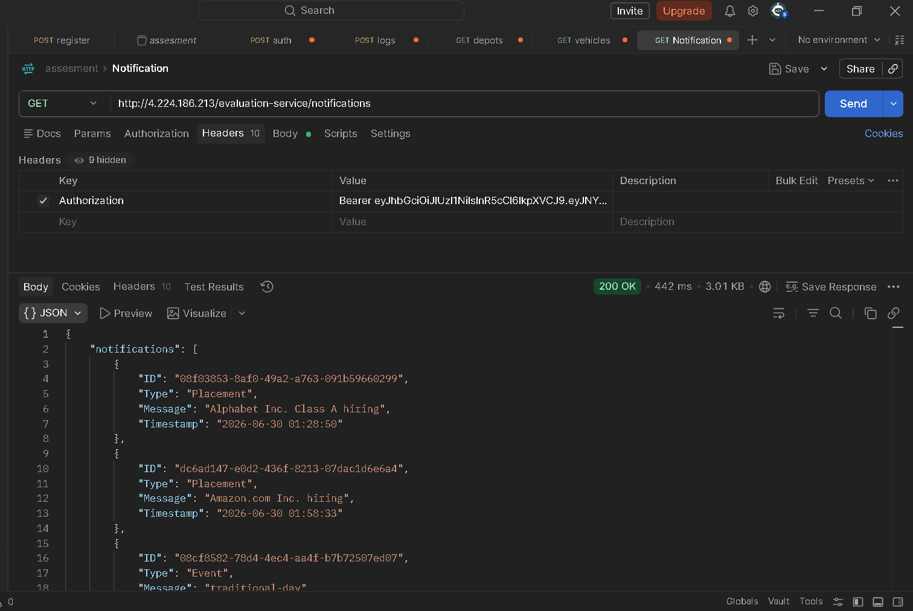

# Notification System Design

## Stage - 1

api end point should be:- 
```router.post("/api/user/login",loginController)```

```loginController``` will take:-
- User details such as 'email' & password.
- Through database will verify student email & password & if it is correct will fetch all the notification of user from the db & will iterate over each notification & will just send the notification whose "isRead":false.

### Header structure
```key :- Content-Type , value :- application/json```


### Body structure
```
{
    "email":" ",
    "password": " "
}
```


### response structure
```
{
    notifications //Array of objects
}
```


## Stage - 2
I will choose mongodb as it supports horizontal scaling which is good if the number of students will increase or notification increases.

```
const UserSchema = new mongoose.Schema({
    email:{
        type:String,
        required:true,
        unique:true
    },
    password:{
        type:String,
        required:true
    },
    notications:[
        {
            message{
                type:String
            },
            isRead:{
                type:boolean,
                default:false
            }
            date:{
                default:Date.now()
            }
        }
    ]
},{timeStamps:true})

```


## stage-3
Indexing would be good for faster searching.

```
select * from table_name where notification_type="Placement" && Date.now()- date <= 7

```


## stage-4
We can use cache in-order to prevent database access on every request


## stage-5
First we should add it in the database after that we can send the email this way is better than the given implementation


## stage-6
